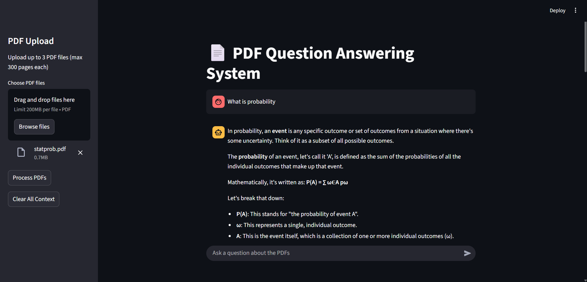
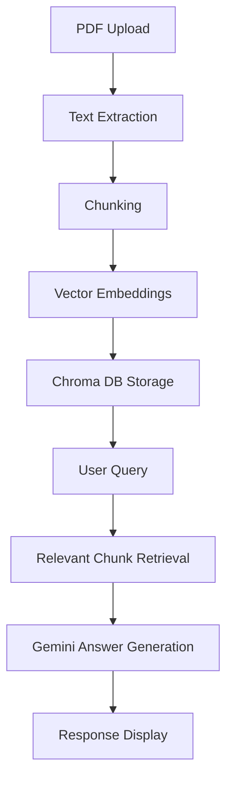

Here's a professional `README.md` for your NeuroQuery project with all requested elements:

```markdown
# NeuroQuery: Intelligent Answers from Your Documents

 <!-- Add your screenshot path here -->

A state-of-the-art document question answering system that extracts knowledge from your PDFs using AI.

## Features

| Feature | Description |
|---------|-------------|
| 📄 Multi-PDF Processing | Upload and analyze up to 3 PDFs simultaneously (300 pages max each) |
| 💬 Natural Language Interface | Ask questions in plain English about your documents |
| 🧠 Smart Context Understanding | Gemini AI provides accurate answers based on document content |
| ⚡ Fast Retrieval | Chroma vector database enables quick information lookup |

 <!-- Add your screenshot path here -->

## Technical Architecture



## Technology Stack

### Core Libraries

| Category | Libraries |
|----------|-----------|
| Framework | `langchain`, `langchain_community` |
| AI Models | `langchain_google_genai` (Gemini) |
| Vector DB | `langchain_chroma` |
| PDF Processing | `pypdf`, `pdfminer.six`, `unstructured` |
| Utilities | `python-dotenv`, `nest_asyncio`, `sentence-transformers` |
| UI | `streamlit` |

## Setup Instructions

### Prerequisites
- Python 3.8+
- Google API key with Gemini access

### Installation

1. Clone the repository:
   ```bash
   git clone https://github.com/yourusername/neuroquery.git
   cd neuroquery
   ```

2. Create and activate virtual environment:
   ```bash
   python -m venv venv
   source venv/bin/activate  # Linux/Mac
   venv\Scripts\activate  # Windows
   ```

3. Install dependencies:
   ```bash
   pip install -r requirements.txt
   ```

4. Create `.env` file:
   ```env
   GOOGLE_API_KEY=your_api_key_here
   ```

### Running the Application
```bash
streamlit run app.py
```

## Deployment Options

| Platform | Instructions |
|----------|--------------|
| Streamlit Cloud | [Deploy Guide](https://docs.streamlit.io/streamlit-community-cloud/deploy-your-app) |
| Hugging Face | [Spaces Guide](https://huggingface.co/docs/hub/spaces) |
| AWS/Azure | Use Docker with Streamlit server |

## Usage Guide

1. Upload PDF documents (max 3 files)
2. Wait for processing to complete
3. Ask questions about the document content
4. View AI-generated answers with source references

## Troubleshooting

- **Processing Errors**: Ensure PDFs contain selectable text (not scanned images)
- **API Errors**: Verify your Google API key has Gemini access
- **Performance**: For large documents, increase chunk size in `config.py`

## License

[MIT License](LICENSE)

---

Developed with ❤️ by [Your Name]
